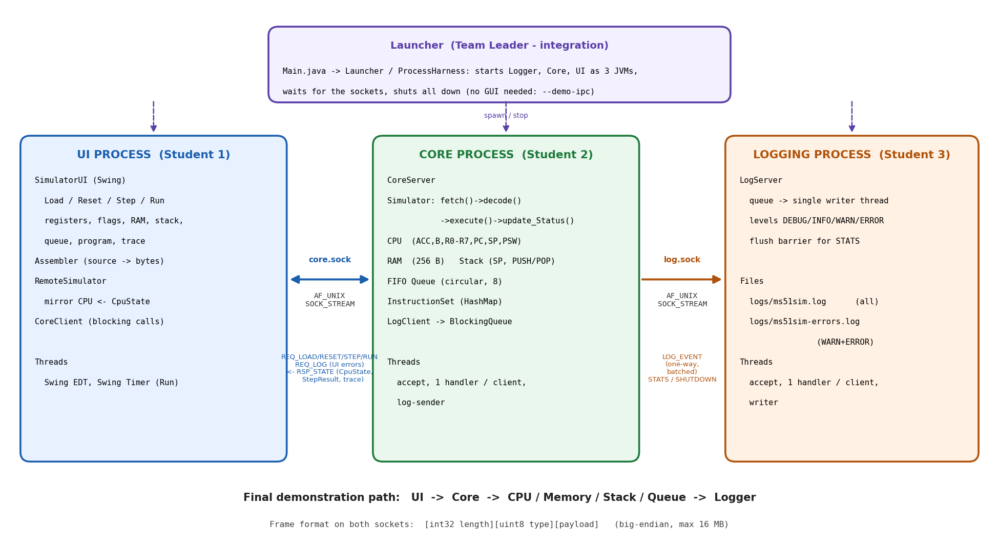
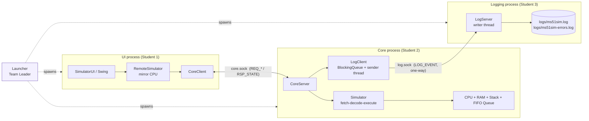

# Week 4 - Three-process architecture and IPC

## 1. Goal

Week 3 was one Java program. Week 4 splits it into **three independent OS processes**:

| Process | Owner | Responsibility | Main classes |
|---|---|---|---|
| **UI** | Student 1 | User interaction, display of registers/flags/RAM/stack/queue/trace; assembles source text into machine code | `ui.SimulatorUI`, `ui.RemoteSimulator`, `ipc.CoreClient`, `Assembler` |
| **Core** | Student 2 | CPU, memory, stack, FIFO queue, fetch -> decode -> execute | `core.CoreServer`, `Simulator`, `CPU`, `FifoQueue`, `InstructionSet` |
| **Logging** | Student 3 | Execution log and error log files | `logging.LogServer`, `logging.LogClient`, `logging.LogEvent` |
| *(integration)* | Team Leader | Launcher, shared IPC contract, tests, benchmark | `launcher.*`, `ipc.Protocol/Wire/Uds`, `tests.IpcTests`, `bench.Benchmark` |

The Week 1-3 simulator classes (`Simulator`, `CPU`, `Alu`, `InstructionSet`, `FifoQueue`, ...) were **not changed**:
the Core process simply hosts them. Only `SimulatorUI` was adapted (it now talks to a `SimulatorBackend`
interface instead of a concrete `Simulator`).

## 2. IPC architecture diagram



(SVG version: `ipc-architecture.svg`)



Request path of one **Step** click:

```
UI: Step button -> RemoteSimulator.step() -> CoreClient.step()
      --- core.sock: REQ_STEP --->
Core: CoreServer.dispatch -> Simulator.step()  [fetch(); decode(); execute(); update_Status()]
      -> CPU / RAM / stack / queue change -> LogClient.log(...)  (queued, non-blocking)
      --- core.sock: RSP_STATE (CpuState + StepResult) --->
UI: apply CpuState to mirror CPU -> TraceFormatter -> repaint panes
Core (in parallel): log-sender thread --- log.sock: LOG_EVENT --->  Logger: writer thread -> ms51sim.log
```

## 3. Choosing the IPC mechanism

### Requirement
Three processes, one of them (Core) talking to two others, request/response in one direction and one-way
streaming in the other, must survive a peer crashing, and must be implementable in **Java** on a POSIX system.

### Options considered

| Option | Fit for this project | Why / why not |
|---|---|---|
| Anonymous pipes (stdin/stdout of child) | Poor | Only parent <-> child, one direction per pipe; Core would have to be a child of the UI and the Logger a child of Core. Crash/restart of one process tears down the others. |
| Named pipes (FIFOs, `mkfifo`) | Fair | Unrelated processes can use them, but each FIFO is **one-way**, so request/response needs two FIFOs per client, there is no notion of "a client connected / disconnected", and Java has no API to create a FIFO (it must shell out to `mkfifo`). |
| POSIX message queues (`mq_open`) | Fair on paper | Nice message boundaries and priorities, but **Java has no API for them** (JNI or the Java 22 FFI would be needed), they are Linux-specific (not on macOS), and there is no built-in request/response pairing. |
| POSIX shared memory (`shm_open`) + semaphores | Overkill | Fastest (zero copy) but we exchange small messages, not big buffers; needs hand-written synchronisation and a wake-up mechanism; again no Java API without native code. |
| TCP sockets on 127.0.0.1 | Good | Portable, bidirectional, connection-oriented. But goes through the whole TCP/IP stack, needs port numbers (conflicts, firewall prompts) and any local user can connect. |
| **Unix domain sockets (AF_UNIX, SOCK_STREAM)** | **Best** | POSIX sockets API, **bidirectional**, **connection-oriented** (we learn when a peer dies), many clients per server, access controlled by file permissions, no ports, skips the network stack, and **available in standard Java since JDK 16** (`StandardProtocolFamily.UNIX`, `UnixDomainSocketAddress`). |

### Decision: Unix domain sockets (stream)
* **POSIX and standard Java**: no native code, no extra libraries, which keeps the project in "Java is the preferred language".
* **Matches the traffic**: UI -> Core is request/response (a socket gives both directions on one connection);
  Core -> Logger is a one-way stream (the same mechanism, we simply never wait for a reply).
* **Failure detection**: when a process dies the kernel closes its sockets, so the peer gets `EOF`/`IOException`
  immediately. The UI shows an error dialog; the Core keeps running and counts dropped log events if the Logger dies.
* **Low overhead**: data is copied once through the kernel, no TCP processing. Measured IPC overhead is in
  `BENCHMARK-AND-ANALYSIS.md`.
* **Trade-offs accepted**: a stream has no message boundaries, so we added length-prefixed framing (`Wire`);
  Unix sockets are not network-transparent (the processes must run on one machine - fine for a simulator);
  Java's NIO sockets have no read time-out, so a hung Core would block the UI (listed under known issues).

## 4. Wire protocol

Every message on both sockets is one **frame**:

```
+------------------+--------------+-------------------------+
| int32  length N  | uint8  type  | N bytes of payload      |   big-endian (Java DataOutputStream)
+------------------+--------------+-------------------------+   N must be 0 .. 16 MiB, otherwise the connection is dropped
```

### UI <-> Core (`core.sock`)

| Type | Name | Payload | Reply |
|---:|---|---|---|
| 1 | `REQ_LOAD` | `int32 n`, `n x uint8` machine code | `RSP_STATE` |
| 2 | `REQ_RESET` | - | `RSP_STATE` |
| 3 | `REQ_STEP` | - | `RSP_STATE` (with the executed `StepResult`) |
| 4 | `REQ_RUN` | `int32 maxSteps`, `bool includeTrace` | `RSP_STATE` (last step, optional full trace) |
| 5 | `REQ_STATE` | - | `RSP_STATE` |
| 6 | `REQ_SET_LOGGING` | `bool` per-step logging | `RSP_ACK` |
| 7 | `REQ_LOG` | `uint8 level`, `UTF message` | `RSP_ACK` (Core forwards it to the Logger as source `UI`) |
| 8 | `REQ_PING` | - | `RSP_ACK` |
| 9 | `REQ_SHUTDOWN` | - | `RSP_ACK`, then the Core exits |
| 101 | `RSP_STATE` | `CpuState`, `uint8 flags` (1 = has last step, 2 = has trace), `[StepResult]`, `[int32 n, n x StepResult]`, `int32 steps`, `int64 coreNanos` | |
| 102 | `RSP_ERROR` | `UTF message` | |
| 103 | `RSP_ACK` | - | |

`CpuState` = ACC, B, SP, PSW (4 x uint8), PC (uint16), halted, finished (2 x bool), programLength (int32),
RAM (256 x uint8), queue length (uint8) + queue bytes front-to-back. The UI applies it to a local *mirror* `CPU`,
so the Week 3 display code works unchanged.

### Core / UI -> Logger (`log.sock`)

| Type | Name | Payload | Reply |
|---:|---|---|---|
| 201 | `LOG_EVENT` | `uint8 level` (0 DEBUG, 1 INFO, 2 WARN, 3 ERROR), `UTF source`, `int64 epochMillis`, `UTF message` | none (one-way) |
| 202 | `LOG_STATS_REQ` | - | `LOG_STATS_RSP` = 5 x `int64` (total, debug, info, warn, error); the Logger flushes its files first |
| 204 | `LOG_SHUTDOWN` | - | `RSP_ACK`, then the Logger exits |

## 5. Threads (task 2)

| Process | Threads | Why |
|---|---|---|
| UI | Swing Event Dispatch Thread; Swing `Timer` drives **Run** (one `REQ_STEP` per tick) | Swing is single-threaded; the timer keeps the window responsive and lets the user press Stop |
| Core | accept thread; one handler thread per connected client; `log-sender` thread | Several clients can connect; the simulator itself is protected by `synchronized(sim)`, so instructions are atomic. Logging never does socket I/O on the execution path: `log()` just enqueues on a bounded `BlockingQueue` (producer/consumer) |
| Logger | accept thread; one handler thread per client; one **writer** thread | Handlers only enqueue; a single writer owns the files (no concurrent writes) and flushes once per burst |

## 6. Failure behaviour (all covered by tests, see `TEST-CASES-AND-RESULTS.md`)

| Failure | Behaviour |
|---|---|
| Logger not running / dies | Core keeps executing correctly; events are counted as *dropped*; Core retries the connection every 0.5 s |
| Core dies | UI gets `IOException` -> status bar + error dialog, controls disabled (IT-04) |
| Client disconnects without saying goodbye | Core keeps its CPU state for the next client (IPC-13) |
| Corrupt frame | That connection is closed and logged; other clients are unaffected (IPC-12) |
| Unknown request type | `RSP_ERROR`, connection stays usable (IPC-11) |
| Stale socket file after a crash | Removed on the next start-up (`Uds.listen`) |

## 7. How to run

```
./build.sh                 # javac (or the JRE's jdk.compiler module) -> ./out
./run.sh                   # Launcher: Logger + Core + Swing UI as three processes
./run.sh demo              # same three processes, but a command-line client instead of the GUI
./run.sh standalone        # Week 3 single-process UI (benchmark baseline)
./run.sh test              # 23 IPC test cases
./run.sh bench             # standalone vs multi-process benchmark
```
Requires **JDK 17+** (Unix domain sockets need 16+, records need 16+). Logs go to `./logs/`.
To start the processes by hand, use three terminals: `--logger`, then `--core`, then `--ui`
(`java -cp out com.team.ms51sim.Main --logger`, etc.); all three read the socket directory from `-Dms51.sockdir=...`
(default `/tmp/ms51sim`).
