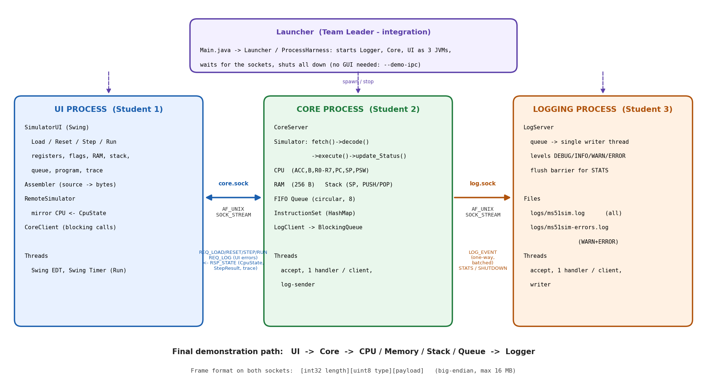
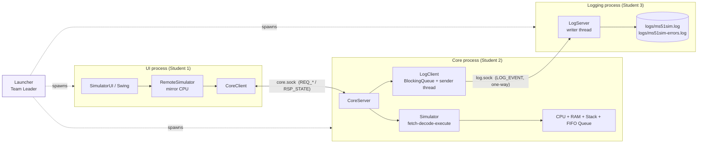

# Week 4 - Three-process architecture 

## 2. IPC architecture diagram

(SVG version: `ipc-architecture.svg`)

```mermaid
flowchart LR
    L[Launcher<br/>Team Leader]:::l
    subgraph UI["UI process (Student 1)"]
      SW[SimulatorUI / Swing] --> RS[RemoteSimulator<br/>mirror CPU] --> CC[CoreClient]
    end
    subgraph CORE["Core process (Student 2)"]
      CS[CoreServer] --> SIM[Simulator<br/>fetch-decode-execute]
      SIM --> HW[CPU + RAM + Stack + FIFO Queue]
      CS --> LC[LogClient<br/>BlockingQueue + sender thread]
    end
    subgraph LOG["Logging process (Student 3)"]
      LS[LogServer<br/>writer thread] --> F[(logs/ms51sim.log<br/>logs/ms51sim-errors.log)]
    end
    CC <-- "core.sock  (REQ_* / RSP_STATE)" --> CS
    LC -- "log.sock  (LOG_EVENT, one-way)" --> LS
    L -. spawns .-> UI
    L -. spawns .-> CORE
    L -. spawns .-> LOG
    classDef l fill:#F3F0FF,stroke:#5B3FA8
```

